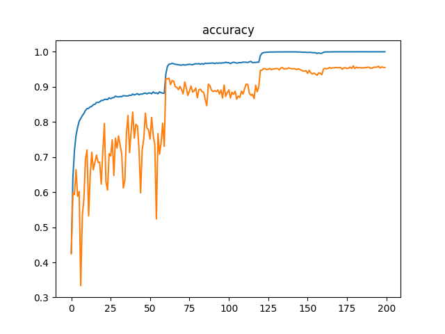

Wide ResNet[[1](https://arxiv.org/abs/1605.07146)]の、Kerasでの実装です。たぶん、もっともシンプルなコードなんじゃないかと。

# Usage

## 準備

~~~ bash
$ pip3 install --upgrade tensorflow-gpu keras funcy matplotlib h5py
~~~

## 訓練

~~~ bash
$ python3 train.py
~~~

## 訓練結果の確認

~~~ bash
$ python3 check.py
~~~

私が試した結果だと、cifar10の精度は95.52%になりました。論文の95.83%に近い値なので、多分コードは大丈夫。

# Notes

* ごめんなさい。Python3とTensorFlowの環境でしか試していません。
* [https://github.com/nutszebra/residual_net](https://github.com/nutszebra/residual_net)と[https://github.com/takedarts/resnetfamily](https://github.com/takedarts/resnetfamily)を参考にして作成しています。
* Kerasに関数型プログラミングのテクニックを適用する方法は、[Kerasと関数型プログラミングを使えば、深層学習（ディープ・ラーニング）は楽ちんですよ](https://tail-island.github.io/programming/2017/10/25/keras-and-fp.html)にまとめました。

# References

* Wide Residual Networks [[1](https://arxiv.org/abs/1605.07146)]
